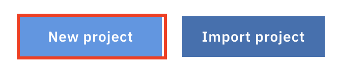

---
# Microclimate and Jenkins Lab
---

This lab is compatible with ICP version 3.1

---

In this tutorial, you create, install, deploy and run a **cloud-native microservice application** on an IBM® Cloud Private platform on Kubernetes.

Microclimate will guide you thru the creation of complete project including all the directories, the manifest files, the monitoring option that you need for a perfect application.

[Link to Microclimate documentation here](https://microclimate-dev2ops.github.io/)

---

# Task 1: Access the console and check Helm

From a machine that is hosting your environment, open a web browser and go to one of the following URLs to access the IBM Cloud Private management console:
  - Open a browser
  - go to https://ipaddress:8443
  - Where ipaddress is the ip address of the ICP cluster given by the instructor with the password.

# Task 2: Check Microclimate

Application workloads can be deployed to run on an IBM Cloud Private cluster. The deployment of an application workload must be made available as a Helm package. Such packages must either be made available for deployment on a Helm repository, or loaded into an IBM Cloud Private internal Helm repository. 

Microclimate has been installed for you on a specific IBM Cloud Private cluster instance. To check that Microclimate and Jenkins are running, go to the ICP console, then **open the hamburger menu on the top left part of the page, then click on Workloads and Helm Releases **

Then on the search field type **microclimate** (this will search all helm releases containing microclimate string)

Microclimate should be already deployed and the light should be green. The latest version is 1.11.0.

Click on the blue link (i.e **microclimate**) :

Browse the page to the bottom to look at the **Deployment section** :

Check that you have all 1 in all columns for the 4 deployments. 

Then go to the **bottom** of that page :

Copy the URL : https://microclimate.ipaddress.nip.io

Finally get access to the **Microclimate portal** with the following link in your browser:

`https://microclimate.<ipaddress>.nip.io`
(replace <ipaddress> with your icp ip address)

Accept the license agreement:

You should click on **No, not this time** and  **Done** and then you are on the main menu:

This concludes the Microclimate login. 

> Note: this installation can also be done thru the ICP Catalog.

# Task 3: Install a simple application

You’re now ready to deploy your Kubernetes application to the IBM Cloud Private environment.  In this case, the deploy command will :

Click on **New project** button:

Choose Node.JS (because we want to create a Node.js application) and type the name: **nodeone** and click **Next**

On the next menu, don't choose any service (but you can notice that we can bind a service to your new application), then click on **Create**

Be patient (it could take a **few minutes**). Your application should appear and the building process could still be running: 

After a few minutes, the application should be running (check the green light):

To access the application, click on the **Open App** button on the left pane:

The application should appear (this is a very simple page):

Navigate on the left pane to the **Edit** button:

At this point, the editor can be used to edit the Node.JS application.

Expand **nodeone** and you can see all predefined files (like Dockerfile, Jenkinsfile, manifest files) and you can look around the code and files necessary for your application. 

Expand **nodeone>public>index.html**

Go to the end of the index.html file and modify the **congratulation** line by adding your name :

Save (**File>Save**) and then re-build the application (because Auto Build is on, building will start automatically after saving) .

Wait until the green light(Running) to see the modification your simple application:

From the main menu of the application, click on **Monitor** to see some metrics:

From here, Click on Projects at the top of the page:

# Task 4: Import and deploy an application

To import a new application from Github, click on the **Project** button. Then choose **Import project**:

On the Import page, type `https://github.com/microclimate-demo/node` as the Git location :

Enter a name : `nodetwo` and click **Finish import and validate**

The validation will detect automatically detect the type of project and then click on **Finish Validation**:

Wait until the application is running (it could take 1 minute) : 

Click on **Open App** icon to go to the application:

# Task 5: Use a pipeline

Microclimate has been linked with Jenkins and so you don't have to install a separated Jenkins instance in IBM Cloud Private. 

Goto the **pipeline** icon and **create a pipeline**:

Type a pipeline name **pipe2** and a repository to get the application (optional)

  

 Click on **Create pipeline**:

Click on **Open Pipeline** to get access to Jenkins  (enter your credentials at some point):

Wait until the progression ends:

# Congratulations

You have successfully created and installed a microservice application with Microclimate.

